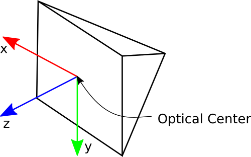

# apriltag_ekf_slam
## Package Summary
This package contains apriltag_detector and apriltag_ekf_slam nodes.
## Nodes

### 1. apriltag_detector

#### Subscribed Topics
1. camera/image_raw ([sensor_msgs/Image](http://docs.ros.org/en/melodic/api/sensor_msgs/html/msg/Image.html))
2. camera/camera_info ([sensor_msgs/CameraInfo](http://docs.ros.org/en/api/sensor_msgs/html/msg/CameraInfo.html))

#### Published Topics
1. apriltag_detected (apriltag_ekf_slam_msga/ApriltagDetection)
2. apriltag_detected/debug_image ([sensor_msgs/Image](http://docs.ros.org/en/melodic/api/sensor_msgs/html/msg/Image.html))
3. tf ([geometry_msgs/TransformStamped](http://docs.ros.org/en/api/geometry_msgs/html/msg/TransformStamped.html))
	- (camera_frame_optical) <--- (tag_<tag_id\>)

#### Params
```YAML
~tag_family: "36h11" #Default: 36h11
~tag_size: 0.15
~pose_covariance_diagonal: [0.2, 0.2, 0.2, 0.2, 0.2, 0.2]
~camera_optical_frame_id: "camera_optical"
~debug: true #Default: false
```
- At present only ~"36h11" is supported.
- Tag is assumed to be square ~tag_size is the size of tag in meters.
- If ~camera_optical_frame_id is not set then frame_id is taken from camera/camera_info message and a suffix "_optical" is added to it (REP103 complaint camera).
- If ~debug is set to true then apriltag_detected/debug_image and tf of tags will be published. By default debug is assumed to be false.

#### Camera Optical Frame (REP103)


### 2. apriltag_ekf_slam

#### Subscribed Topics
1. apriltag_detected ([apriltag_ekf_slam/ApriltagDetection](./msg/))
2. tf ([geometry_msgs/TransformStamped](http://docs.ros.org/en/api/geometry_msgs/html/msg/TransformStamped.html))
	- (odom) <--- (base_footprint)
	- (base_footprint) <--- (camera_optical)

#### Published Topics
1. tf ([geometry_msgs/TransformStamped](http://docs.ros.org/en/api/geometry_msgs/html/msg/TransformStamped.html))
	- (map) <--- (odom)
	- (map) <--- (tag_i) for all tag_id i those are being tracked
2. robot_pose ([geometry_msgs/PoseWithCovarianceStamped](http://docs.ros.org/en/melodic/api/geometry_msgs/html/msg/PoseWithCovarianceStamped.html))
	- Pose of robot with covariance in map frame
#### Params
```YAML
~debug: "true" #Default: false
~state_update_frequency: 10 #Default: 10
~Frames:
  odom: "odom" #Default: odom
  base_footprint: "base_footprint" #Default: base_footprint
  map: "map" #Default: map
~MotionModelParameters:
  sigma_xy_min: 0 #Default: 0
  sigma_th_min: 0 #Default: 0
  alpha1: 0.002 #Default: 0.002
  alpha2: 0.0005 #Default: 0.0005
  alpha3: 0.0005 #Default: 0.0005
  alpha4: 0.002 #Default: 0.002
```
